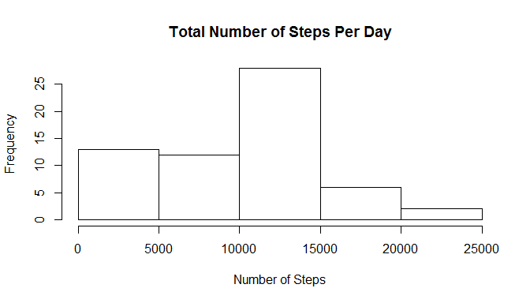
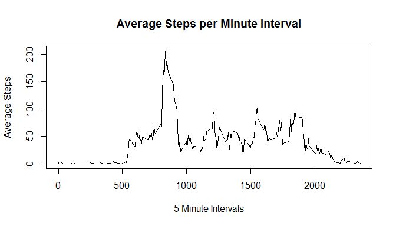
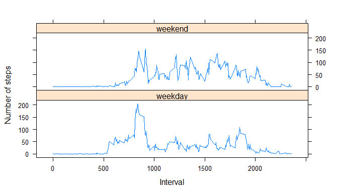

# Reproducible Research: Peer Assessment 1


## Loading and preprocessing the data


```r
activity <- read.csv("activity.csv")
```

## What is mean total number of steps taken per day?

### Histogram of the total number of steps taken per day

```r
totalSteps <- aggregate(activity$steps, by=list(activity$date), FUN=sum, na.rm=TRUE)
hist(totalSteps$x, main = "Total Number of Steps Per Day", xlab="Number of Steps")
```

 

### Mean total number of steps per day:

```r
mean(totalSteps$x)
```

```
## [1] 9354.23
```

### Median total number of steps per day:

```r
median(totalSteps$x)
```

```
## [1] 10395
```

## What is the average daily activity pattern?

### Time series of the average number of across all days per 5 minute interval

```r
avgSteps <-aggregate(activity$steps, by=list(activity$interval), FUN=mean, na.rm=TRUE)
plot(avgSteps, type = 'l', ylab = "Average Steps", xlab = "5 Minute Intervals", 
      main = "Average Steps per Minute Interval")
```

 

### 5 minute interval with the maximum average number of steps

```r
avgSteps[ avgSteps$x == max(avgSteps$x), ]
```

```
##     Group.1        x
## 104     835 206.1698
```

## Imputing missing values

### Total number of NA values

```r
length(which(is.na(activity$steps)))
```

```
## [1] 2304
```

### Fill in the missing values with the median value of the steps for each interval

```r
newActivity <- activity
newActivity$steps[is.na(newActivity$steps)] <- with(newActivity, ave(steps, interval, 
   FUN = function(x) median(x, na.rm = TRUE)))[is.na(newActivity$steps)]
newTotalSteps <- aggregate(newActivity$steps, by=list(newActivity$date), FUN=sum)
```

### Histogram of the total number of steps per day with the imputed values

```r
hist(newTotalSteps$x, main = "Total Number of Steps Per Day", xlab="Number of Steps")
```

 

### Mean total number of steps per day (with imputed values):

```r
mean(newTotalSteps$x)
```

```
## [1] 9503.869
```

### Median total number of steps per day (with imputed values):

```r
median(newTotalSteps$x)
```

```
## [1] 10395
```

## Are there differences in activity patterns between weekdays and weekends?

### Add factor variable to indicate activity on weekdays and weekends

```r
newActivity$day <- weekdays(as.Date(newActivity$date))
weekEnds <- c('Saturday', 'Sunday')
newActivity$type <- factor((newActivity$day %in% weekEnds), 
      levels=c(FALSE, TRUE), labels=c('weekday', 'weekend'))
```

### Time series plot comparing average number of steps per 5 minute intervals on weekdays and weekends

```r
library(datasets)
library(lattice)
```

```
## Warning: package 'lattice' was built under R version 3.2.2
```

```r
newAvgSteps <-aggregate(newActivity$steps, by=list(newActivity$type, newActivity$interval), FUN=mean)
xyplot(x ~ Group.2 | Group.1, data=newAvgSteps, type='l', layout=c(1,2), 
      ylab = "Number of steps", xlab = "Interval")     
```

 

